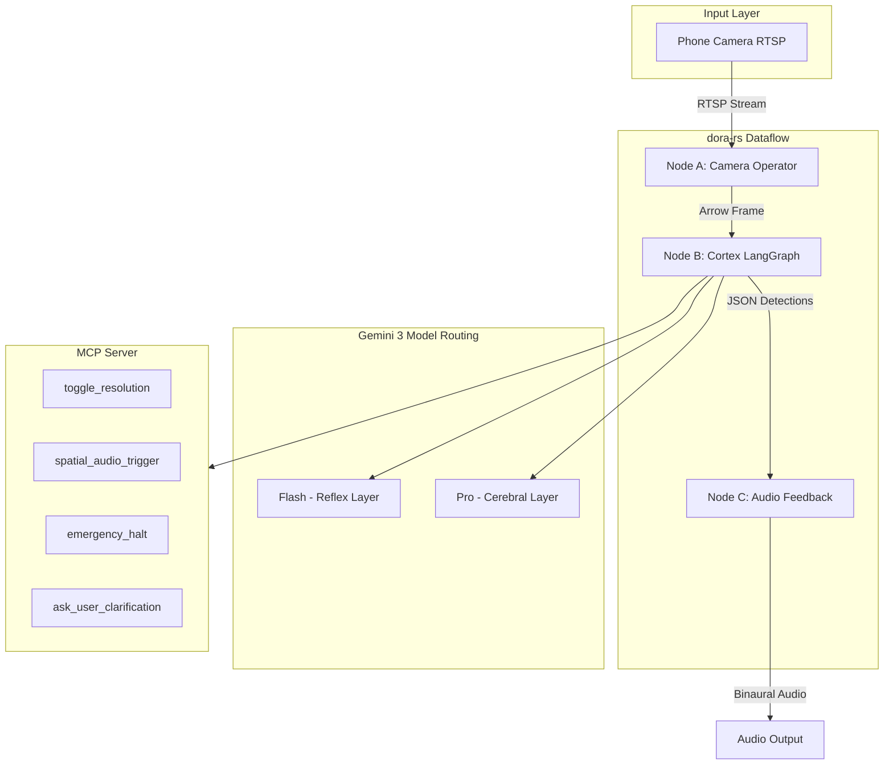
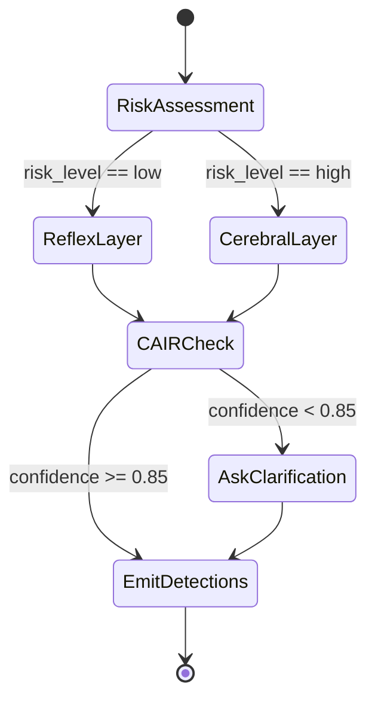

# Synthetic Cortex Vision System Implementation Plan

## Architecture Overview



## Project Structure

```
/synthetic-cortex
├── README.md
├── Dockerfile
├── docker-compose.yml
├── .env
├── requirements.txt
├── dataflow.yaml
├── src/
│   ├── __init__.py
│   ├── nodes/
│   │   ├── __init__.py
│   │   ├── camera_operator.py      # RTSP capture + Arrow serialization
│   │   ├── cortex_operator.py      # LangGraph state machine
│   │   └── feedback_operator.py    # Spatial audio generation
│   ├── langgraph/
│   │   ├── __init__.py
│   │   ├── state.py                # ThoughtSignature state schema
│   │   ├── graph.py                # StateMachine with Reflex/Cerebral routing
│   │   └── nodes.py                # LangGraph node functions
│   ├── mcp/
│   │   ├── __init__.py
│   │   └── server.py               # MCP tool server
│   ├── gemini/
│   │   ├── __init__.py
│   │   ├── client.py               # Gemini 3 API wrapper
│   │   └── thought_signatures.py   # Signature capture/injection logic
│   ├── audio/
│   │   ├── __init__.py
│   │   └── spatial.py              # Binaural panning with pydub
│   └── cair/
│       ├── __init__.py
│       └── evaluator.py            # CAIR metric calculation and logging
└── configs/
    └── cair_thresholds.yaml        # Confidence thresholds configuration
```

---

## Implementation Tasks

### Task 1: dora-rs Dataflow Configuration

Create `dataflow.yaml` defining three connected nodes:

- **camera**: Python operator sampling RTSP at configurable FPS
- **cortex**: LangGraph processor receiving Arrow-serialized frames
- **feedback**: Audio generator receiving JSON detection results

Key config: Apache Arrow IPC for zero-copy frame sharing between nodes.

---

### Task 2: Camera Operator Node

File: [`src/nodes/camera_operator.py`](src/nodes/camera_operator.py)

Responsibilities:

- Connect to RTSP stream (`rtsp://<PHONE_IP>:5554/live`)
- Sample frames at configurable rate (default 10 FPS for Flash, 2 FPS for Pro)
- Serialize frames to Apache Arrow format for zero-copy transfer
- Emit frames to dora dataflow

---

### Task 3: LangGraph State Machine with Thought Signatures

Files:

- [`src/langgraph/state.py`](src/langgraph/state.py) - State schema
- [`src/langgraph/graph.py`](src/langgraph/graph.py) - StateMachine definition
- [`src/gemini/thought_signatures.py`](src/gemini/thought_signatures.py) - Signature management

State Schema:

```python
class CortexState(TypedDict):
    frame: bytes                           # Current frame data
    thought_signatures: List[dict]         # Multi-step history
    detections: List[Detection]            # Current frame detections
    confidence: float                      # CAIR confidence score
    risk_level: Literal["low", "high"]     # Determines model routing
    requires_clarification: bool           # Triggers user prompt
```

StateMachine Flow:



---

### Task 4: Gemini 3 Client with Model Routing

File: [`src/gemini/client.py`](src/gemini/client.py)

Two model configurations:

- **Reflex (Flash)**: `thinking_level="minimal"`, `media_resolution="low"`
- **Cerebral (Pro)**: `thinking_level="high"`, `media_resolution="high"`

Critical: Implement thought_signature capture-and-return loop:

1. Extract `thought_signature` from response `candidates[].content.parts`
2. Store in state's `thought_signatures` list
3. Inject back into next request's conversation history

---

### Task 5: MCP Server with Tools

File: [`src/mcp/server.py`](src/mcp/server.py)

Exposed tools:

| Tool | Description |

|------|-------------|

| `toggle_resolution` | Switch camera between low/high resolution |

| `spatial_audio_trigger` | Play directional audio cue |

| `emergency_halt` | Immediate system stop |

| `ask_user_clarification` | Audio prompt when CAIR < threshold |

---

### Task 6: Spatial Audio Feedback

File: [`src/audio/spatial.py`](src/audio/spatial.py)

Convert detection bounding boxes to binaural audio:

- X-position (0-1) maps to stereo pan (-1 to +1)
- Detection confidence maps to volume
- Object type maps to distinct tone frequencies

---

### Task 7: CAIR Evaluator

File: [`src/cair/evaluator.py`](src/cair/evaluator.py)

Implements: `CAIR = Value / (Risk x Correction)`

Metrics tracked:

- **Value**: Successful hazard detections
- **Risk**: False positive rate, latency spikes
- **Correction**: Time-to-correction when model misidentifies

Integration with